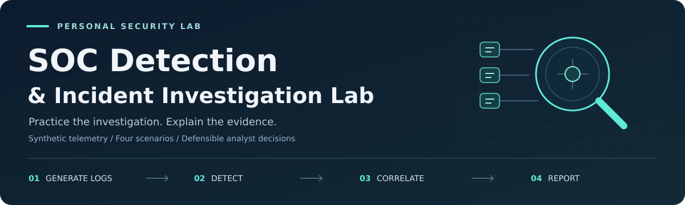

<p align="center">
  
</p>

<h1 align="center">SOC Detection &amp; Incident Investigation Lab</h1>

<p align="center">
  <a href="compose.yaml"></a>
  <a href="scripts/generate_events.py"></a>
  <a href="compose.yaml"></a>
</p>
<p align="center">
  <a href="docs/validation.md#local-validation"></a>
  <a href="docs/validation.md#pending-live-verification"></a>
</p>
<p align="center">
  <sub>Local SVG badges describe repository configuration and recorded validation; they are not live CI indicators.</sub>
</p>

**A personal security lab for practicing detection, evidence correlation, and
defensible incident decisions with Splunk.** Four synthetic scenarios move from
log generation to readable SPL, analyst triage, severity, escalation, and reports.

The problem this project addresses is the gap between finding a suspicious event
and explaining what it means. Each investigation preserves evidence, tests a
hypothesis against legitimate alternatives, and states what remains unknown.

> **Lab only:** all hosts, identities, addresses, and incidents are fictional.
> No malware, real login attacks, account changes, or network scans are executed.
> This is portfolio work, not production SOC or employment experience.

**Status:** Python generators and local reference checks pass. Docker/Splunk
configuration, four SPL searches, and worked investigations are implemented.
**Live Splunk ingestion/search execution and screenshots are pending manual
verification.** Read the precise [validation record](docs/validation.md).

## Skills demonstrated

- SIEM ingestion configuration and structured-log field validation.
- Threshold and process-indicator detection with explainable SPL.
- Host, identity, process, timestamp, and outcome correlation.
- False-positive assessment, incident classification, and severity reasoning.
- Escalation recommendations, conditional remediation, and repeatable reports.

## Quick start

Use Python 3.10+ and Docker Engine with Compose on x86-64 Linux. Python scripts
have **no third-party dependencies**. Allow a practical lab budget of about 4
cores, 8 GB available RAM, and 15 GB free disk. The full
[Fedora/Splunk setup guide](setup/splunk-setup.md) covers installation and recovery.

From the repository root:

```bash
python3 scripts/generate_events.py
python3 -m unittest discover -s tests -v
python3 scripts/analyze_events.py --output reports/offline-findings.json
cp -n .env.example .env
chmod 600 .env
```

Edit `.env`: choose a unique `SPLUNK_PASSWORD`. Read the Splunk terms linked in
the [setup guide](setup/splunk-setup.md); if you accept them, set:

```dotenv
SPLUNK_START_ARGS=--accept-license
SPLUNK_GENERAL_TERMS=--accept-sgt-current-at-splunk-com
```

Then start the configured image:

```bash
docker compose config --quiet
docker compose pull
docker compose up -d
docker compose ps
docker compose logs --tail=80 splunk
```

Open **http://127.0.0.1:8000**, sign in as `admin` with your local password, and
choose **Search & Reporting → All time**. Set account display timezone to UTC.
The fixed fixture date is **2026-01-15**, so “Last 15 minutes” will not find it.
The file monitor ingests the mounted JSONL automatically; no manual upload/token
is required. Keep `.env` and startup diagnostics private.

```spl
index=soc_lab sourcetype="soc:json"
| stats count AS raw_events dc(event_uid) AS unique_events BY scenario
```

Expect **47 unique events**: 12 authentication, 3 PowerShell, 4 account/group,
and 28 network records. On first ingestion raw and unique counts should agree.
Follow [timestamp, field, and search verification](setup/log-ingestion.md).
Stop the service without deleting evidence using `docker compose stop`.

## Architecture and data flow

```text
Endpoint / Event Generator
          │
          ▼
       Log Files
          │
          ▼
       Splunk
          │
          ▼
   Detection Searches
          │
          ▼
         Alert
          │
          ▼
        Triage
          │
          ▼
 Investigation / Correlation
          │
          ▼
 Severity + Escalation
          │
          ▼
    Incident Report
```

The endpoint stage is simulated by Python. A single Splunk container performs
input, indexing, and searching; `soc_lab` is the index and `soc:json` the
sourcetype. A search result is the initial finding; saved reports and optional
alerts preserve it. Analysts make the incident decision. The offline Python
analyzer checks fixture behavior; it is not an SPL interpreter or a second SIEM.

Technologies: **Splunk/SPL, Python, Docker Compose, Fedora/Linux, JSON Lines,
normalized Windows/Sysmon-style events, Markdown, and MITRE ATT&CK**. Native
Windows collection is not required. See [architecture](architecture/architecture.md)
and [event schema](docs/event-schema.md) for normalization and enrichment caveats.

## Detection scenarios

Exactly four scenarios are implemented, with benign comparison events:

1. **[Brute force / failed logins](scenarios/01-brute-force/README.md)** — five
   failures per source/host/user within a fixed five-minute bucket; fixture
   produces eight and a later success. [SPL](detections/brute-force.spl) ·
   [Investigation](investigations/incident-001.md).
2. **[Suspicious PowerShell](scenarios/02-suspicious-powershell/README.md)** —
   encoded-command or execution-policy-bypass arguments. The encoded payload is
   harmless and never run. [SPL](detections/suspicious-powershell.spl) ·
   [Investigation](investigations/incident-002.md).
3. **[Admin account creation](scenarios/03-admin-account-creation/README.md)** —
   detect successful local Administrators membership, then correlate creation
   and actor context. [SPL](detections/admin-account-creation.spl) ·
   [Investigation](investigations/incident-003.md).
4. **[Suspicious network activity](scenarios/04-suspicious-network-activity/README.md)**
   — at least 20 attempts and 10 unique ports per source/destination in a minute;
   fixture has 24 blocked attempts to 24 ports. [SPL](detections/suspicious-network.spl)
   · [Investigation](investigations/incident-004.md).

Each guide includes source fields, exact SPL, logic, threshold, expected result,
false positives, tuning, evasion limitations, and a triage pivot.

## Reproduce each scenario

```bash
python3 scripts/generate_events.py --scenario brute-force
python3 scripts/generate_events.py --scenario suspicious-powershell
python3 scripts/generate_events.py --scenario admin-account-creation
python3 scripts/generate_events.py --scenario suspicious-network
```

`python3 scripts/generate_auth_events.py` and
`python3 scripts/generate_linux_events.py` are authentication convenience entry
points. Run without `--scenario` on the main generator to reproduce all four.
Generation is deterministic and leaves identical existing files untouched.
Stable event IDs allow the detections to deduplicate repeated fixture copies;
regenerating files is not a new incident or a promise of reingestion.

Paste each `.spl` file into Search & Reporting with **All time**. Each should
return one finding; compare the detailed expected fields in the scenario guide.
Use the correlation query to inspect what occurred immediately before/after.

## Investigation and incident-response workflow

Activity → log generation → Splunk ingestion → detection/finding → triage →
evidence collection → correlation → hypothesis → legitimate alternatives →
classification → severity → escalation decision → recommended remediation → report.

The [triage playbook](docs/triage-playbook.md) answers the 14 core analyst
questions. The [detection methodology](docs/detection-methodology.md) explains
rule design, field inspection, thresholds, and testing. Every worked case
includes all 20 required report fields, with actual detection timestamps left
unrecorded until live replay rather than invented.

Severity is based on confidence, asset context, privilege, attack success, scope,
persistence/lateral movement potential, and data impact:

- **LOW:** supported benign/approved explanation and limited impact.
- **MEDIUM:** credible suspicious activity, uncertain intent, or blocked behavior.
- **HIGH:** plausible unauthorized successful access or unexplained privilege gain.
- **CRITICAL:** supported severe ongoing or widespread impact; not shown here.

Example findings: the success after repeated failures warrants HIGH-priority
review; the known harmless PowerShell simulation closes at LOW; unexplained new
administrator membership is HIGH; all-blocked probing is MEDIUM and needs owner
context. Escalations are recommendations only. See the
[final SOC report](reports/final-soc-report.md) for the summary and reasoning.

## Repeatable reporting

```bash
python3 scripts/generate_report.py --scenario brute-force --incident-id LAB-REPLAY-001 --output reports/replay-001.md
```

This populates the [20-field template](reports/incident-report-template.md) with
source hashes, observed identities, offline findings, and a chronological evidence
timeline. Analyst decisions stay explicit; the tool refuses to overwrite an
existing report. Choose a new output filename for each replay. Worked cases are
kept separately in `investigations/` so a draft cannot silently replace analysis.

## Screenshots and optional dashboard

Follow the [capture guide](screenshots/README.md): ingestion, four detections,
authentication timeline, and optionally the dashboard/actual saved alert. No
fake screenshots or placeholder image links are included.

A small bundled **SOC Lab** dashboard displays events over time, events by host,
failed authentications, and network outcomes. Open Apps → SOC Lab after startup.
These panels count telemetry, not incidents by severity; manual analyst decisions
are documented in reports. XML structure is locally checked; rendering is part
of live verification.

## Repository map

```text
architecture/       Architecture and trust boundaries
setup/              Docker/Splunk instructions and bundled app
scenarios/          Four end-to-end scenario guides
detections/         Four readable SPL searches
scripts/            Generators, offline analyzer, report helper
logs/               Safe deterministic JSONL fixtures
investigations/     Four worked 20-field incident investigations
reports/            Template, offline findings, final SOC report
screenshots/        Manual evidence capture checklist
docs/               Schema, methodology, playbook, validation, interview/resume notes
tests/              Local behavior and artifact validation
```

## Verification and interview preparation

Run `python3 -m unittest discover -s tests -v` and the
[five-minute live checklist](docs/validation.md). Tests cover fixture reproducibility,
thresholds, grouping, controls, duplicate events, safe PowerShell decoding, and
field contracts. They do not execute SPL or measure security accuracy.

Prepare with [interview notes](docs/interview-notes.md) and
[honest resume bullets](docs/resume-bullets.md). Be ready to explain why a finding
is suspicious, what evidence supports escalation, and what cannot be concluded.

## MITRE ATT&CK references

Behavioral mappings used conditionally in the reports:

- [T1110.001 — Password Guessing](https://attack.mitre.org/techniques/T1110/001/).
- [T1059.001 — PowerShell](https://attack.mitre.org/techniques/T1059/001/).
- [T1136.001 — Local Account](https://attack.mitre.org/techniques/T1136/001/).
- [T1098.007 — Additional Local or Domain Groups](https://attack.mitre.org/techniques/T1098/007/).
- [T1046 — Network Service Discovery](https://attack.mitre.org/techniques/T1046/).

Mappings describe modeled behavior or hypotheses; they do not prove adversary
intent. No attribution, exfiltration, or lateral-movement claim is made.

## Limitations and future improvements

This is a small synthetic dataset with no actual endpoint collection, native
EVTX/syslog parser, EDR integration, real change tickets, or production baseline.
Some process/session fields are explicitly synthetic enrichment. Thresholds are
teaching choices; fixed buckets can miss boundary-spanning/slow/distributed
activity and simple PowerShell patterns miss obfuscation. A correct local
reference result does not prove actual Splunk ingestion or SPL execution.

Finish live replay before adding capabilities. Future improvements could include
authorized Linux/Windows collectors, measured baselines, sliding-window logic,
ingestion-delay handling, more robust process normalization, and EDR enrichment.
No extra scenarios are implemented yet. A license has not been selected for this
repository; Splunk has its own separate licensing terms.
